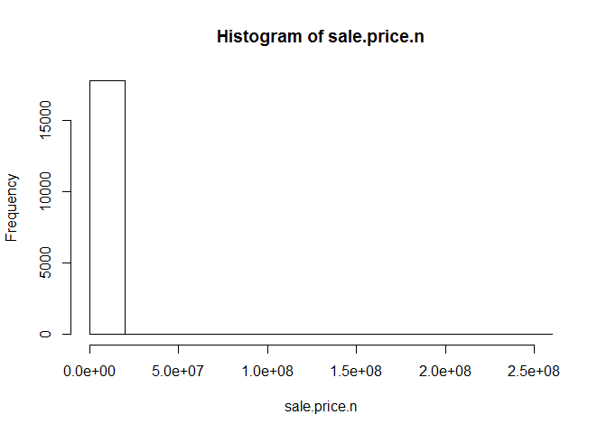
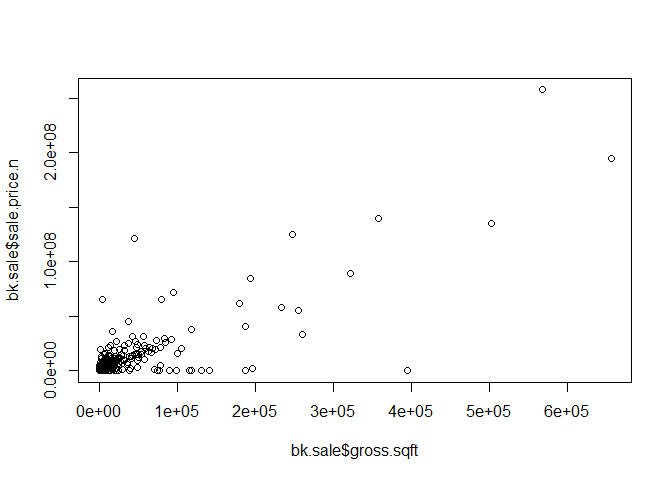
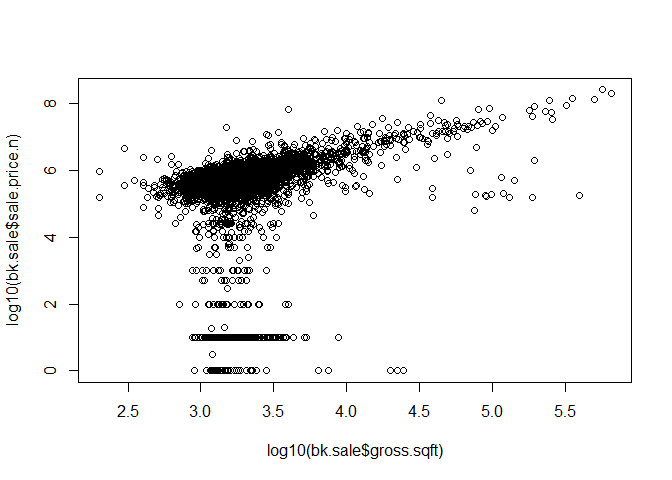
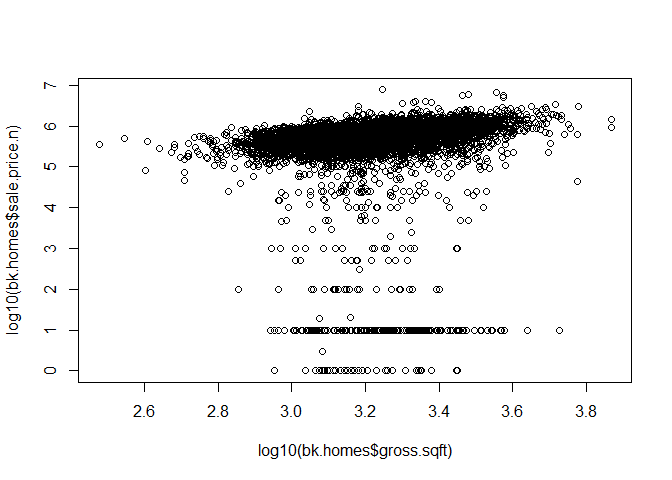
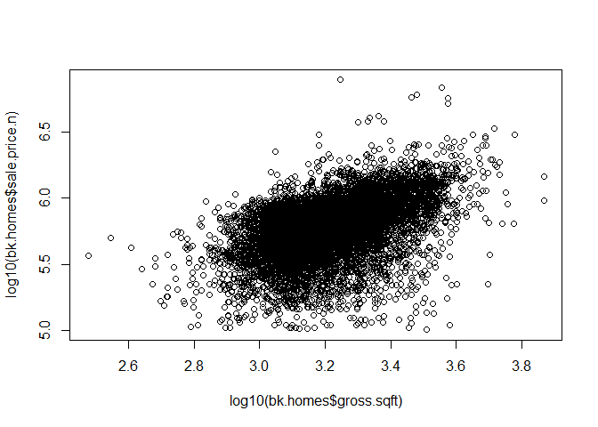

# DataCleaningQueensRMD
PaulRaminRamya  
June 17, 2017  


##  Setting the Working Directory

```r
library(plyr)
setwd("C:\\Users\\aura7\\Documents\\SMU\\Courses\\Summer1\\DoingDS_MSDS6306\\week6\\Unit6_Assignment\\Rollingsales_queens_v1\\Analysis\\Data")

# http://www1.nyc.gov/site/finance/taxes/property-rolling-sales-data.page
```

## Read csv file

```r
bk <- read.csv("rollingsales_queens.csv",skip=4,header=TRUE)
```
## Check the data


```r
head(bk)
```

```
##   BOROUGH              NEIGHBORHOOD
## 1       4 AIRPORT LA GUARDIA       
## 2       4 AIRPORT LA GUARDIA       
## 3       4 AIRPORT LA GUARDIA       
## 4       4 AIRPORT LA GUARDIA       
## 5       4 AIRPORT LA GUARDIA       
## 6       4 AIRPORT LA GUARDIA       
##                        BUILDING.CLASS.CATEGORY TAX.CLASS.AT.PRESENT BLOCK
## 1 01  ONE FAMILY DWELLINGS                                        1   976
## 2 01  ONE FAMILY DWELLINGS                                        1   976
## 3 01  ONE FAMILY DWELLINGS                                        1   976
## 4 01  ONE FAMILY DWELLINGS                                        1   976
## 5 02  TWO FAMILY DWELLINGS                                        1   976
## 6 03  THREE FAMILY DWELLINGS                                      1   949
##   LOT EASE.MENT BUILDING.CLASS.AT.PRESENT
## 1  10        NA                        A5
## 2  11        NA                        A5
## 3  61        NA                        A5
## 4  63        NA                        A5
## 5  70        NA                        B1
## 6  56        NA                        C0
##                                     ADDRESS APARTMENT.NUMBER ZIP.CODE
## 1 21-10 81ST STREET                                             11370
## 2 21-12 81ST STREET                                             11370
## 3 21-21 80TH   STREET                                           11370
## 4 21-17 80TH   STREET                                           11370
## 5 21-03 80TH   STREET                                           11370
## 6 19-69 80TH   STREET                                           11370
##   RESIDENTIAL.UNITS COMMERCIAL.UNITS TOTAL.UNITS LAND.SQUARE.FEET
## 1                 1             -              1            1,800
## 2                 1             -              1            1,800
## 3                 1             -              1            1,800
## 4                 1             -              1            1,800
## 5                 2             -              2            1,800
## 6                 3             -              3            2,000
##   GROSS.SQUARE.FEET YEAR.BUILT TAX.CLASS.AT.TIME.OF.SALE
## 1             1,224       1950                         1
## 2             1,224       1950                         1
## 3             1,224       1950                         1
## 4             1,224       1950                         1
## 5             1,224       1950                         1
## 6             2,835       1945                         1
##   BUILDING.CLASS.AT.TIME.OF.SALE SALE.PRICE  SALE.DATE
## 1                             A5    600,000  4/10/2017
## 2                             A5    600,000  4/10/2017
## 3                             A5    660,000  7/26/2016
## 4                             A5    275,500 11/18/2016
## 5                             B1       -     6/13/2016
## 6                             C0       -     8/15/2016
```

```r
summary(bk)
```

```
##     BOROUGH                     NEIGHBORHOOD  
##  Min.   :4   FLUSHING-NORTH           : 2712  
##  1st Qu.:4   ASTORIA                  : 1181  
##  Median :4   BAYSIDE                  : 1131  
##  Mean   :4   FOREST HILLS             : 1052  
##  3rd Qu.:4   JACKSON HEIGHTS          :  947  
##  Max.   :4   FLUSHING-SOUTH           :  894  
##              (Other)                  :17910  
##                                  BUILDING.CLASS.CATEGORY
##  01  ONE FAMILY DWELLINGS                    :8246      
##  02  TWO FAMILY DWELLINGS                    :5588      
##  10  COOPS - ELEVATOR APARTMENTS             :3797      
##  13  CONDOS - ELEVATOR APARTMENTS            :1728      
##  09  COOPS - WALKUP APARTMENTS               :1250      
##  03  THREE FAMILY DWELLINGS                  :1249      
##  (Other)                                     :3969      
##  TAX.CLASS.AT.PRESENT     BLOCK            LOT       EASE.MENT     
##  1      :15160        Min.   :   13   Min.   :   1   Mode:logical  
##  2      : 7292        1st Qu.: 2783   1st Qu.:  16   NA's:25827    
##  4      : 1727        Median : 5893   Median :  39                 
##  2A     :  577        Mean   : 6565   Mean   : 209                 
##  1B     :  381        3rd Qu.: 9946   3rd Qu.:  81                 
##  1A     :  366        Max.   :16322   Max.   :8009                 
##  (Other):  324                                                     
##  BUILDING.CLASS.AT.PRESENT
##  A1     : 3809            
##  D4     : 3797            
##  A5     : 1992            
##  B3     : 1947            
##  B2     : 1841            
##  R4     : 1645            
##  (Other):10796            
##                                       ADDRESS          APARTMENT.NUMBER
##  131-05 40TH   ROAD                       :  145               :22850  
##  136-21 LATIMER PLACE                     :   79   2A          :   53  
##  31-35 31ST   STREET                      :   61   2B          :   51  
##  42-60 CRESCENT STREET                    :   56   3B          :   48  
##  34-32 35TH   STREET                      :   52   3A          :   46  
##  14-34 110TH   STREET                     :   45   4A          :   40  
##  (Other)                                  :25389   (Other)     : 2739  
##     ZIP.CODE     RESIDENTIAL.UNITS COMMERCIAL.UNITS  TOTAL.UNITS   
##  Min.   :    0   1      :10618     0      :24001    1      :11657  
##  1st Qu.:11360   0      : 7437     1      : 1008    0      : 6029  
##  Median :11375   2      : 5684      -     :  500    2      : 5605  
##  Mean   :11293   3      : 1302     2      :  162    3      : 1580  
##  3rd Qu.:11419   4      :  280     3      :   54    4      :  315  
##  Max.   :11697   6      :  171     4      :   32    6      :  214  
##                  (Other):  335     (Other):   70    (Other):  427  
##  LAND.SQUARE.FEET GROSS.SQUARE.FEET   YEAR.BUILT  
##   -     : 8524     -     : 9167     Min.   :   0  
##  4,000  : 1917    1,224  :  175     1st Qu.:1925  
##  2,500  : 1302    1,600  :  169     Median :1945  
##  2,000  : 1249    1,280  :  139     Mean   :1846  
##  3,000  :  675    1,440  :  133     3rd Qu.:1960  
##  1,800  :  428    1,200  :  129     Max.   :2016  
##  (Other):11732    (Other):15915                   
##  TAX.CLASS.AT.TIME.OF.SALE BUILDING.CLASS.AT.TIME.OF.SALE   SALE.PRICE   
##  Min.   :1.000             A1     : 3813                   -     : 8035  
##  1st Qu.:1.000             D4     : 3797                  10     :  204  
##  Median :1.000             A5     : 1993                  650,000:  155  
##  Mean   :1.521             B3     : 1930                  450,000:  151  
##  3rd Qu.:2.000             B2     : 1835                  250,000:  150  
##  Max.   :4.000             R4     : 1728                  600,000:  136  
##                            (Other):10731                  (Other):16996  
##       SALE.DATE    
##  11/10/2016:  182  
##  6/30/2016 :  174  
##  11/22/2016:  165  
##  10/28/2016:  163  
##  12/8/2016 :  162  
##  12/22/2016:  157  
##  (Other)   :24824
```

```r
str(bk) # Very handy function!
```

```
## 'data.frame':	25827 obs. of  21 variables:
##  $ BOROUGH                       : int  4 4 4 4 4 4 4 4 4 4 ...
##  $ NEIGHBORHOOD                  : Factor w/ 59 levels "AIRPORT LA GUARDIA       ",..: 1 1 1 1 1 1 1 1 2 2 ...
##  $ BUILDING.CLASS.CATEGORY       : Factor w/ 44 levels "01  ONE FAMILY DWELLINGS                    ",..: 1 1 1 1 2 3 12 12 1 1 ...
##  $ TAX.CLASS.AT.PRESENT          : Factor w/ 11 levels "  ","1","1A",..: 2 2 2 2 2 2 6 6 2 2 ...
##  $ BLOCK                         : int  976 976 976 976 976 949 949 949 15829 15830 ...
##  $ LOT                           : int  10 11 61 63 70 56 1012 1025 22 20 ...
##  $ EASE.MENT                     : logi  NA NA NA NA NA NA ...
##  $ BUILDING.CLASS.AT.PRESENT     : Factor w/ 127 levels "  ","A0","A1",..: 7 7 7 7 11 15 91 91 3 3 ...
##  $ ADDRESS                       : Factor w/ 22698 levels "-00 136TH   AVENUE                       ",..: 9071 9081 9121 9102 9051 8315 8307 19194 12682 12432 ...
##  $ APARTMENT.NUMBER              : Factor w/ 1161 levels "            ",..: 1 1 1 1 1 1 254 2 1 1 ...
##  $ ZIP.CODE                      : int  11370 11370 11370 11370 11370 11370 11370 11370 11691 11691 ...
##  $ RESIDENTIAL.UNITS             : Factor w/ 84 levels " -   ","0","1",..: 3 3 3 3 26 34 3 3 3 3 ...
##  $ COMMERCIAL.UNITS              : Factor w/ 25 levels " -   ","0","1",..: 1 1 1 1 1 1 1 1 1 1 ...
##  $ TOTAL.UNITS                   : Factor w/ 95 levels " -   ","0","1",..: 3 3 3 3 29 40 3 3 3 3 ...
##  $ LAND.SQUARE.FEET              : Factor w/ 3236 levels " -   ","1,000",..: 369 369 369 369 369 722 1 1 1213 1071 ...
##  $ GROSS.SQUARE.FEET             : Factor w/ 2917 levels " -   ","1,000",..: 196 196 196 196 196 1661 1 1 440 436 ...
##  $ YEAR.BUILT                    : int  1950 1950 1950 1950 1950 1945 0 0 2005 2005 ...
##  $ TAX.CLASS.AT.TIME.OF.SALE     : int  1 1 1 1 1 1 2 2 1 1 ...
##  $ BUILDING.CLASS.AT.TIME.OF.SALE: Factor w/ 125 levels "A0","A1","A2",..: 6 6 6 6 10 14 89 89 2 2 ...
##  $ SALE.PRICE                    : Factor w/ 3285 levels " -   ","1","1,000",..: 2397 2397 2564 1184 1 1 1830 1448 1373 1619 ...
##  $ SALE.DATE                     : Factor w/ 355 levels "1/1/2017","1/10/2017",..: 182 182 284 72 241 302 9 69 305 51 ...
```

```r
#Compactly display the internal structure of an R object.
```


## clean/format the data with regular expressions
More on these later. For now, know that the pattern "[^[:digit:]]" refers to members of the variable name that start with digits. We use the gsub command to replace them with a blank space. We create a new variable that is a "clean' version of sale.price. And sale.price.n is numeric, not a factor.


```r
bk$SALE.PRICE.N <- as.numeric(gsub("[^[:digit:]]","", bk$SALE.PRICE))
count(is.na(bk$SALE.PRICE.N))
```

```
##       x  freq
## 1 FALSE 17792
## 2  TRUE  8035
```

```r
names(bk) <- tolower(names(bk)) # make all variable names lower case
```

## Get rid of leading digits

```r
bk$gross.sqft <- as.numeric(gsub("[^[:digit:]]","", bk$gross.square.feet))
bk$land.sqft <- as.numeric(gsub("[^[:digit:]]","", bk$land.square.feet))
bk$year.built <- as.numeric(as.character(bk$year.built))
```

## do a bit of exploration to make sure there's not anything weird going on with sale prices

```r
attach(bk)
hist(sale.price.n) 
```

<!-- -->

```r
detach(bk)
```
## keep only the actual sales

```r
bk.sale <- bk[bk$sale.price.n!=0,]
plot(bk.sale$gross.sqft,bk.sale$sale.price.n)
```

<!-- -->

```r
plot(log10(bk.sale$gross.sqft),log10(bk.sale$sale.price.n))
```

<!-- -->
## for now, let's look at 1-, 2-, and 3-family homes

```r
bk.homes <- bk.sale[which(grepl("FAMILY",bk.sale$building.class.category)),]
dim(bk.homes)
```

```
## [1] 9900   24
```

```r
plot(log10(bk.homes$gross.sqft),log10(bk.homes$sale.price.n))
```

<!-- -->

```r
summary(bk.homes[which(bk.homes$sale.price.n<100000),])
```

```
##     borough                     neighborhood
##  Min.   :4   SOUTH JAMAICA            : 24  
##  1st Qu.:4   JACKSON HEIGHTS          : 21  
##  Median :4   SPRINGFIELD GARDENS      : 21  
##  Mean   :4   HOLLIS                   : 19  
##  3rd Qu.:4   ST. ALBANS               : 19  
##  Max.   :4   OZONE PARK               : 18  
##              (Other)                  :286  
##                                  building.class.category
##  01  ONE FAMILY DWELLINGS                    :224       
##  02  TWO FAMILY DWELLINGS                    :151       
##  03  THREE FAMILY DWELLINGS                  : 33       
##  04  TAX CLASS 1 CONDOS                      :  0       
##  05  TAX CLASS 1 VACANT LAND                 :  0       
##  06  TAX CLASS 1 - OTHER                     :  0       
##  (Other)                                     :  0       
##  tax.class.at.present     block            lot          ease.ment     
##  1      :408          Min.   :  517   Min.   :   1.00   Mode:logical  
##         :  0          1st Qu.: 6031   1st Qu.:  18.00   NA's:408      
##  1A     :  0          Median :10065   Median :  33.50                 
##  1B     :  0          Mean   : 8883   Mean   :  54.89                 
##  1C     :  0          3rd Qu.:12179   3rd Qu.:  59.00                 
##  2      :  0          Max.   :16229   Max.   :1642.00                 
##  (Other):  0                                                          
##  building.class.at.present                                      address   
##  A1     :113               116-29 221ST STREET                      :  4  
##  B3     : 72               30-80 42ND STREET                        :  4  
##  A2     : 49               99-19 203RD   STREET                     :  3  
##  A5     : 43               10325 SPRINGFIELD BLVD                   :  2  
##  B2     : 39               122-30 192ND   STREET                    :  2  
##  B1     : 36               13021 140 STREET                         :  2  
##  (Other): 56               (Other)                                  :391  
##      apartment.number    zip.code     residential.units commercial.units
##              :408     Min.   :11001   1      :224       0      :385     
##  1           :  0     1st Qu.:11373   2      :151        -     : 19     
##  1-A         :  0     Median :11414   3      : 33       1      :  4     
##  1-B         :  0     Mean   :11413    -     :  0       10     :  0     
##  1-C         :  0     3rd Qu.:11429   0      :  0       11     :  0     
##  1-F         :  0     Max.   :11694   10     :  0       12     :  0     
##  (Other)     :  0                     (Other):  0       (Other):  0     
##   total.units  land.square.feet gross.square.feet   year.built  
##  1      :221   4,000  : 54      1,200  :  7       Min.   :1901  
##  2      :153   2,000  : 29      1,120  :  6       1st Qu.:1925  
##  3      : 34   2,500  : 27      1,848  :  6       Median :1930  
##   -     :  0   3,000  : 18      1,304  :  5       Mean   :1940  
##  0      :  0   2,200  : 10      1,496  :  5       3rd Qu.:1950  
##  10     :  0   5,000  :  9      1,545  :  5       Max.   :2016  
##  (Other):  0   (Other):261      (Other):374                     
##  tax.class.at.time.of.sale building.class.at.time.of.sale   sale.price 
##  Min.   :1                 A1     :113                    10     :166  
##  1st Qu.:1                 B3     : 72                    1      : 35  
##  Median :1                 A2     : 49                    100    : 24  
##  Mean   :1                 A5     : 43                    25,000 : 21  
##  3rd Qu.:1                 B2     : 39                    1,000  : 17  
##  Max.   :1                 B1     : 36                    10,000 : 15  
##                            (Other): 56                    (Other):130  
##       sale.date    sale.price.n       gross.sqft     land.sqft    
##  11/28/2016:  6   Min.   :    1.0   Min.   : 400   Min.   :  613  
##  12/19/2016:  6   1st Qu.:   10.0   1st Qu.:1277   1st Qu.: 2200  
##  10/14/2016:  5   Median :   19.5   Median :1578   Median : 3000  
##  3/9/2017  :  5   Mean   :14063.1   Mean   :1758   Mean   : 3233  
##  6/28/2016 :  5   3rd Qu.:20000.0   3rd Qu.:2082   3rd Qu.: 4000  
##  9/15/2016 :  5   Max.   :95000.0   Max.   :5950   Max.   :10293  
##  (Other)   :376
```
## remove outliers that seem like they weren't actual sales

```r
bk.homes$outliers <- (log10(bk.homes$sale.price.n) <=5) + 0
bk.homes <- bk.homes[which(bk.homes$outliers==0),]
```
## Plot of Clean Data

```r
plot(log10(bk.homes$gross.sqft),log10(bk.homes$sale.price.n))
```

<!-- -->
