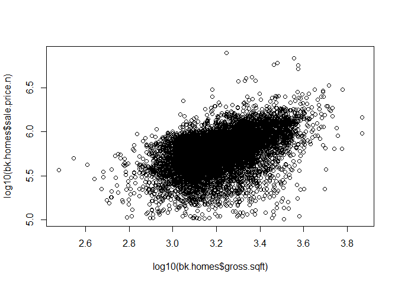

# Data_Analysis_RMD
Paul Ramin Ramya  
June 17, 2017  


## This is the Analysis of the rollingsales_queens data file after it has been cleaned and limited to 1,2 and 3 family homes.  The Cleaning process is included in the R Code to this markdown, but not in this Markdown itself.  The cleaning process is described in detail in "data_cleaning_Markdown."


##  Preliminary Analysis of relationship between Square footage and Sales Price in Queens.
On Clean data with Outliers removed, for 1-3 Family Properties.
Starting point for analysis by other Factor Variables


```r
plot(log10(bk.homes$gross.sqft),log10(bk.homes$sale.price.n))
```

<!-- -->

To the eye it appears that there is a positive correllation between log10 Square Footage and log10 Sale Price in Queens overall.
